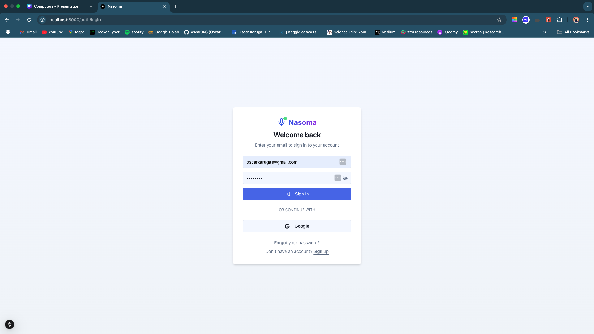
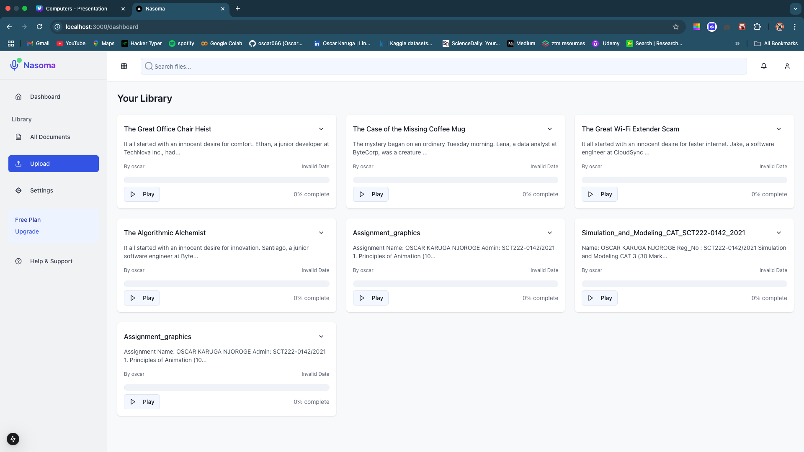
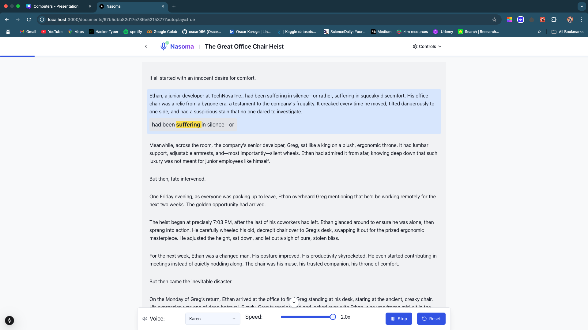

# Nasoma - Text-to-Speech System for Student Learning

[](https://opensource.org/licenses/MIT)

## 📚 Overview

Nasoma is an affordable,a text-to-speech application designed specifically for students. It enhances reading efficiency and engagement by converting written content to speech with synchronized text highlighting. The application makes educational content more accessible by providing a user-friendly interface for document management and audio playback.

### Application Screenshots

#### Login Interface

*Secure authentication with email/password or social login options*

#### User Dashboard

*Document management interface with recently accessed files and upload options*

#### Document Reader

*Interactive reading interface with synchronized text highlighting and playback controls*

## ✨ Features

- **Document Management**: Upload and manage PDF, DOCX, and TXT files
- **Text-to-Speech Conversion**: High-quality voice synthesis with multiple voice options
- **Synchronized Text Highlighting**: Visual tracking of text as it's being read
- **Adjustable Reading Speed**: Control playback speed up to 3.0x (600 WPM)
- **Voice Customization**: Select from various system voices
- **User Authentication**: Secure login and personal document library
- **Cross-Platform Compatibility**: Works across major operating systems and browsers

## 🚀 Getting Started

### Prerequisites

- Node.js (v14.0.0 or higher)
- MongoDB (local or Atlas connection)
- Modern web browser (Chrome, Firefox, Edge, Safari)

### Installation

1. Clone this repository:
   ```bash
   git clone https://github.com/yourusername/nasoma.git
   cd nasoma
   ```

2. Install frontend dependencies:
   ```bash
   cd client
   npm install
   ```

3. Install backend dependencies:
   ```bash
   cd ../backend/server
   npm install
   ```

### Running the Application

1. Start the backend server:
   ```bash
   cd backend/server
   npm run dev
   ```

2. Start the frontend application:
   ```bash
   cd client
   npm run dev
   ```

3. Access the application at `http://localhost:3000`

## 🏗️ Architecture

### Frontend

- **Framework**: Next.js
- **Styling**: Tailwind CSS
- **Authentication**: NextAuth.js
- **State Management**: React Context API / Apollo Client

### Backend

- **Server**: Express.js (Node.js)
- **Database**: MongoDB
- **Authentication**: JWT
- **Text Processing**: PDF.js, pdf-parse

### Text-to-Speech Engine

- System-level TTS APIs for different platforms:
  - macOS: `say` command-line utility
  - Windows: Windows Speech SDK
  - Linux: eSpeak synthesis engine
- Coqui TTS as a fallback option

## 📋 API Endpoints

| Method | Endpoint | Description |
|--------|----------|-------------|
| POST | `/api/auth/register` | Register a new user |
| POST | `/api/auth/login` | Authenticate a user |
| GET | `/api/documents` | Get user's documents |
| POST | `/api/pdf/upload` | Upload a document |
| GET | `/api/documents/:id` | Get document by ID |
| GET | `/api/voices` | Get available voices |
| GET | `/api/speak` | Stream TTS output |

## 🧩 Components

- **Login/Registration**: User authentication interface
- **Dashboard**: Document management and overview
- **Upload Interface**: File upload with preview
- **TTS Reader**: Text display with audio controls and highlighting
- **Settings Panel**: Voice and playback customization

## 🤝 Contributing

Contributions are welcome! Please feel free to submit a Pull Request.

1. Fork the repository
2. Create your feature branch (`git checkout -b feature/amazing-feature`)
3. Commit your changes (`git commit -m 'Add some amazing feature'`)
4. Push to the branch (`git push origin feature/amazing-feature`)
5. Open a Pull Request

## 📄 License

This project is licensed under the MIT License - see the [LICENSE](LICENSE) file for details.

## 🙏 Acknowledgements

- [Next.js](https://nextjs.org/)
- [Tailwind CSS](https://tailwindcss.com/)
- [Express.js](https://expressjs.com/)
- [MongoDB](https://www.mongodb.com/)
- [PDF.js](https://mozilla.github.io/pdf.js/)
- [Coqui TTS](https://github.com/coqui-ai/TTS)

## 📧 Contact

Email: ["oscarkaruga1@gmail.com"]

---
Made with ❤️ for students everywhere